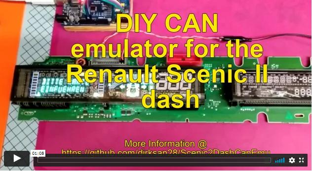

# A lowcost DIY CAN emulator for the Renault Scenic II dash

[](https://vimeo.com/512398946 "CAN-Emulator in action - Click to Watch!")

## Features
- powers up your dashboard without the need of installation in the car
- large test sequence with more then 100 built-in test CAN messages 
- standalone operation (only with charging adapter) possible
- if connected to a serial console: timestamp and message logging on screen

## What you need
- an Arduino (Uno) a cheap clone also works ;-)
- a MCP2515 module (e.g. this one https://www.amazon.com/-/de/dp/B08HM...336095&sr=8-11)
- The Arduino IDE https://www.arduino.cc/en/software to compile and upload the sketch to the arduino. 

## Hardware


On the MCP2515 board there is a jumper which is labeled J1. To function properly make sure it is closed so the CAN-Bus termination is enabled.

### Wireing
| PIN on Arduino  | PIN on MCP2515 CAN Bus Breakout Board  |
| ------------ | ------------ |
|D2|INT|
|D10|CS|
|D11|SI|
|D12|SO|
|D13|SCK|
|5V |VCC|
|GND|GND|


|PIN# (grey connector on dash)| meaning|
| ------------ | ------------ |
|1|+12V|
|2|GND|
|29|CAN LOW|
|30|CAN HI|

## Software
The arduino project is attached to this post and can be compiled and uploaded via the Arduino IDE.
The code which runs on the arduino is based on [ MCP_CAN_lib]([https://github.com/coryjfowler/MCP_CAN_lib](https://github.com/coryjfowler/MCP_CAN_lib)
A copy of this library (and the full source code for the emulator) can be found within the provided zip file. Just put the can-library into the library folder of the Arduino IDE.

The Message-Sequence can be extended or modified by patching for the the following within the [canEmu.ino](./Arduino/canEmulator/canEmu.ino "link to canEmu.ino") file:
### Code
```c
...
/**
 * the following stuct contains the messages which are send to the dash
 * feel free to add or remove messages.
 * {duration, id, dlc {byte1, byte2, ... byte_dlc}}
**/
const struct msgStruct messages[] PROGMEM = { 
  {20, 0x35D, 8, {0x90, 0x03, 0x00, 0x00, 0x00, 0x01, 0x50, 0x00}}
  ,{4, 0x743, 8, {0x02, 0x10, 0xC0, 0x00, 0x00, 0x00, 0x00, 0x00}}
  ,{1, 0x743, 8, {0x04, 0x30, 0x06, 0x20, 0xFF, 0x00, 0x00, 0x00}}
  ,{1, 0x743, 8, {0x04, 0x30, 0x07, 0x20, 0xFF, 0x00, 0x00, 0x00}}
  ,{1, 0x743, 8, {0x04, 0x30, 0x01, 0x20, 0x01, 0x00, 0x00, 0x00}}
  ,{1, 0x743, 8, {0x04, 0x30, 0x01, 0x20, 0x07, 0x00, 0x00, 0x00}}
  ,{1, 0x743, 8, {0x04, 0x30, 0x01, 0x20, 0x06, 0x00, 0x00, 0x00}}
  . . .
  };
```
To see what the code is doing. Start the serial console of the Arduino IDE with 9600 Boud.

## Further infos & links
- If your search for further information, tips & tricks on how to rapair your Renault Scenic II dashboard - take a look at https://www.digital-kaos.co.uk/forums/showthread.php/59335-repair-dashboard-scenic-2
