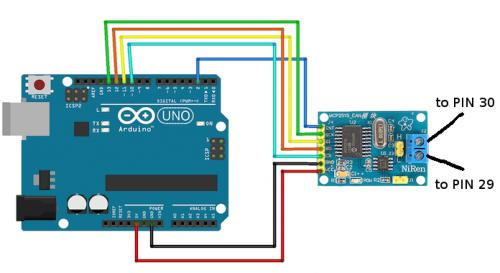
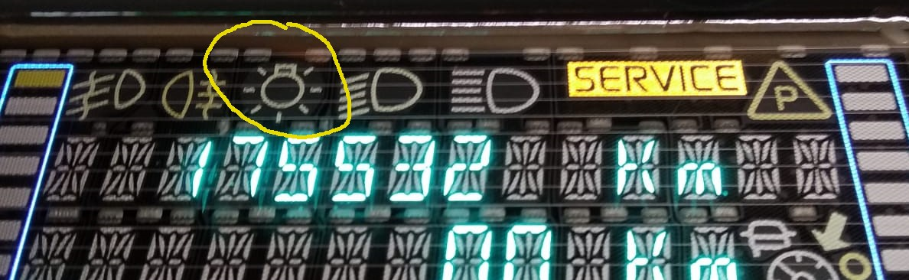
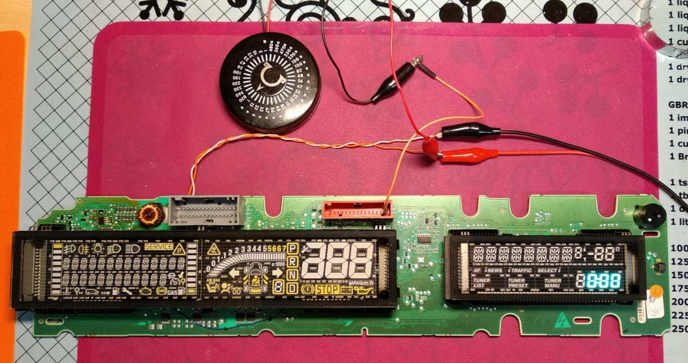

# A lowcost DIY CAN bus emulator for Renault Scenic 2 dashboard repair
*My personal contribution to the right to repair initiative.*

## Features
- build to test your Renault Scenic 2 dashboard after and during repair
- powers up your dashboard without the need of installation in the car
- large test sequence. Shows saved km/milage on startup. (see video) 
- if connected to a serial console: timestamp and message logging on screen
- standalone operation (only with charging adapter) possible

\
[](https://vimeo.com/568058419 "CAN bus - Emulator in action - Click to watch on Vimeo!")

[click to watch the full vid on Vimeo](https://vimeo.com/568058419)


## What you need
- an Arduino (Uno) a cheap clone also works ;-)
- a MCP2515 module (e.g. https://www.amazon.com/s?k=MCP2515)
- The Arduino IDE https://www.arduino.cc/en/software to compile and upload the sketch to the arduino. 

## Hardware


### Wireing
#### Arduino <-> MCP2515

| PIN on Arduino  | PIN on MCP2515 CAN Bus Breakout Board  |
| ------------ | ------------ |
|D2|INT|
|D10|CS|
|D11|SI|
|D12|SO|
|D13|SCK|
|5V |VCC|
|GND|GND|

On the MCP2515 board there is a jumper which is labeled J1.
To work properly, make sure it is closed so the CAN bus termination is enabled.

#### The dashboard
|PIN# (grey connector on dash)| meaning|
| ------------ | ------------ |
|1|+12V|
|2|GND|
|29|CAN LOW|
|30|CAN HI|

##### Hint 
The dash takes about 4-5 amps peak current (filament heating, caps) when it starts up.
Especially when using small current limiting lab power supplies this may become a thing.
Make sure your power supply and cabling is sufficient.

## Software
The arduino project can be compiled and uploaded via the Arduino IDE. Either clone this project or download it as a [ZIP-File](https://github.com/dirksan28/Scenic2DashCanEmu/archive/refs/heads/main.zip).
The code which runs on the arduino is based on [MCP_CAN_lib](https://github.com/coryjfowler/MCP_CAN_lib).
For convenience a copy of this library also is part of this project. Just put the can-library into the library folder of your Arduino IDE (on linux: ~/Arduino/libraries).

The Message-Sequence can be extended or modified by patching the following code fragments within the [canEmu.ino](./Arduino/canEmulator/canEmulator.ino "link to canEmu.ino") file:

### Code
```c
/**
 * the following stuct contains the messages which are send to the dash
 * for initialization
 * feel free to add or remove messages.
 * {duration, id, dlc {byte1, byte2, ... byte_dlc}}
**/
const struct msgStruct initMessages[] PROGMEM = {
   {10, 0x35d, 8, { 0x10, 0x03, 0x20, 0x00, 0x00, 0x00, 0x50, 0x00}}   //dash on
  ,{4, 0x60d, 8, { 0x00, 0x10, 0x00, 0x00, 0x27, 0x73, 0x21, 0x71}}    //reset displ state
...
};

/**
 * the following stuct contains the messages which are send to the dash
 * within a loop
 * feel free to add or remove messages.
 * {duration, id, dlc {byte1, byte2, ... byte_dlc}}
**/
const struct msgStruct messages[] PROGMEM = { //load into flash-memory (sram was to small)
  {1, 0x743, 8, {0x02, 0x10, 0xC0, 0x00, 0x00, 0x00, 0x00, 0x00}}  //enable indicators
  ,{3, 0x743, 8, {0x04, 0x30, 0x06, 0x20, 0xFF, 0x00, 0x00, 0x00}} //left ind. lights
  ,{3, 0x743, 8, {0x04, 0x30, 0x07, 0x20, 0xFF, 0x00, 0x00, 0x00}}
  ,{1, 0x743, 8, {0x04, 0x30, 0x01, 0x20, 0x01, 0x00, 0x00, 0x00}}
  ,{1, 0x743, 8, {0x04, 0x30, 0x01, 0x20, 0x07, 0x00, 0x00, 0x00}}
  ,{1, 0x743, 8, {0x04, 0x30, 0x01, 0x20, 0x06, 0x00, 0x00, 0x00}}
  ...
  };
```
To see what the code is doing. Start the serial console of the Arduino IDE at 9600 Boud.

#### Hint
If you remove line #4
```
#define ENABLE_CANBUS
```
output to the MCP2515 breakout board will be skipped.
By doing so the code runs fine within the free [WOKI Online Arduino Simulator](https://wokwi.com/arduino/new?template=arduino-uno) wich makes it easier for debugging purposes.

## Current state
The code was tested on a V5.14 dashbord and runs fine.

## Design principles
- keep it stupid simple
- even "non-arduino experts" should be able to use and set up the project easily
- keep dependencies as few as possible (e.g. libraries, source files, additional hardware, ...)
- adaptable and expandable even without knowledge of C / C ++

## Collection of ideas
- Read the CAN messages from an external SD card (thus support for different dashboards without having to compile the code)
- single step mode (possibly forwards and backwards) via an additional button
- PCB layout for a self containing, single board solution

## Known issues
- CAN message to activate the lightbulb symbol is currently unknown
  <br>

## Further infos & links
### Resources
- If you search for further information, **tips & tricks on how to rapair your Renault Scenic II dashboard** - take a look at https://www.digital-kaos.co.uk/forums/showthread.php/59335-repair-dashboard-scenic-2
- Radovan Petković Raša shows here the **systematic troubleshooting and successful repair** of a Scenic II dashboard with lots of tips and great advice. **The best video** on this topic that can be found **online**. If you don't speak Serbian, just turn on automatic subtitle translation. https://www.youtube.com/watch?v=_f3Z28OoKZQ  - Thank you for the time and effort you put into this. Great work!
- A good repair video, which also shows **how to desolder the large display properly** (unfortunately in french - but the subtitle function should do the trick) https://www.youtube.com/watch?v=UUcnZQbhVvc

### How to powerup without any CAN-bus emulator
For an initial test on your desk, you can partially switch on the dashboard (only the small clock display) even without a CAN-bus emulator.
<br> Therefor connect the **gray connector** to your power supply as usual:
- Pin1 +12V
- Pin2 GND 

And on the **[red connector](./pics/Scenic2SteeringWheelRadioRemote.pdf)** 
- Pin1 via a 1kΩ resistor to +12V

This simulates the same situation as turning on your radio in the car and therefore results in the clock display turning on.

### Forks and Variants
- Thanks to the great work of David Douard there is now also a fork based on **ESP32 + SN65HVD230** as CAN transceiver available. Check https://github.com/douardda/Scenic2DashCanEmu for details.
